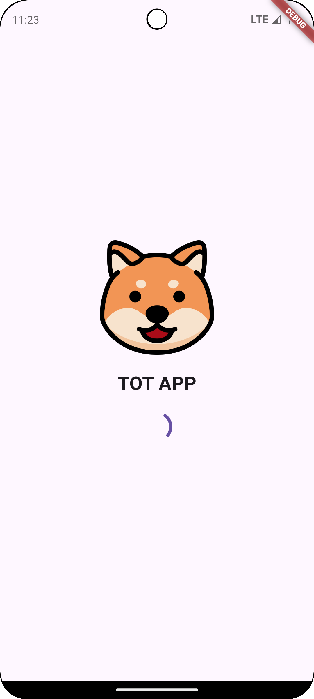
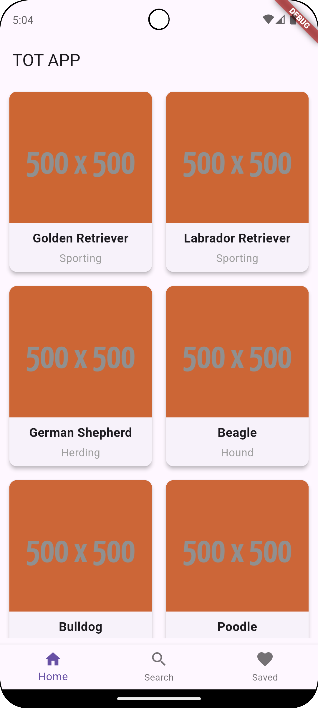
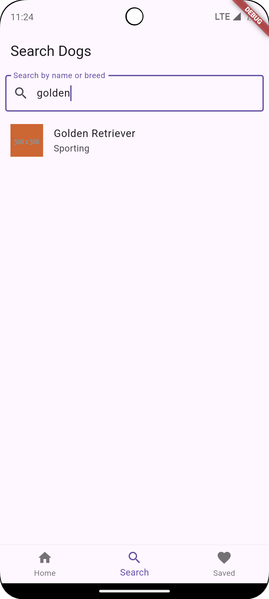
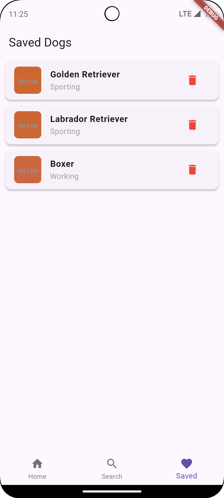
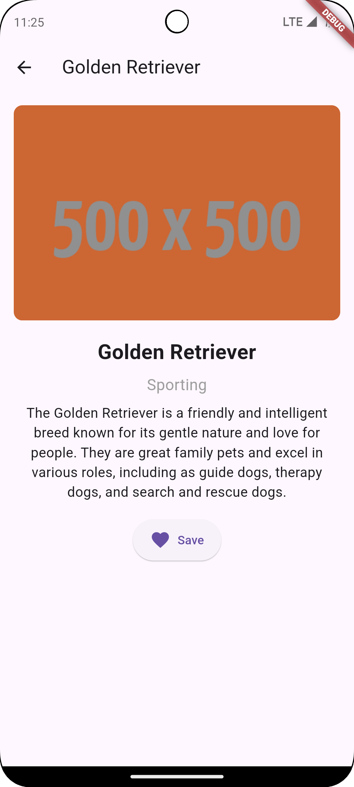

# 🐶 TOT APP - Dog Information App

TOT APP is a **Flutter application** that fetches and displays information about different dog breeds using the [FreeTestAPI for Dogs](https://freetestapi.com/apis/dogs).  
Users can **search for dogs, view details, save favorites to a local database (SQLite), and manage saved entries.**

---

## 📌 Features

✅ Fetches a list of dogs from the API  
✅ Displays **dog name, breed, and image** in a **grid layout**  
✅ **Search functionality** to find dogs by name or breed  
✅ **Dog detail screen** with breed group and description  
✅ **Save dogs locally (SQLite) & view saved dogs**  
✅ **Bottom Navigation Bar** (Home, Search, Saved Dogs)  
✅ **Error handling & offline support**

---

## 🛠️ Installation & Setup

### 🔹 1. Clone the Repository
```sh
git clone https://github.com/your-username/tot-app.git
cd tot-app
```

### 🔹 2. Install Dependencies
```sh
flutter pub get
```

### 🔹 3. Run the App
For Android:
```sh
flutter run
```
---

## 📂 Code Structure
```
/lib
│── /db                  # SQLite Database Helper
│── /models              # Data Models (Dog)
│── /providers           # State Management with Provider
│── /screens             # UI Screens (Home, Search, Detail, Saved)
│── /images              # App assets (placeholder images, icons)
│── main.dart            # Main entry point of the app
│── pubspec.yaml         # Flutter dependencies
```

---


## 📸 Screenshots

### 🏠 Splash Screen
 

### 🏠 Home Screen
  

### 🔍 Search Screen
  

### ❤️ Saved Screen
  

### ❤️ Detail Screen


---
Download APK

Download the latest APK from the following link:  
[Download APK](apk/tot_app_v1.apk)

---

### 🚀 Happy Coding! Let me know if you need changes! 🎉🐶  
